# cka-lab-notes

A central, practical knowledge base for CKA troubleshooting and kubectl usage.

## Goal

If you have a problem (`"I have issue X"`), this repository should be the first place to check:
- matching troubleshooting guide,
- focused cheat sheet,
- and concrete commands to verify/fix quickly.

The current study mode is build/break/fix: learn each component by creating a
minimal working chain, breaking one link, diagnosing it with exam-safe commands,
and explaining the component boundary back in plain language.

## Repository Structure

```text
/
├── README.md
├── troubleshooting/
│   ├── nodes-not-ready.md
│   ├── network.md
│   └── kubelet-certs.md
├── cheatsheets/
│   ├── kubectl-jsonpath.md
│   └── kubectl-context.md
├── DEMO/
└── labs/
```

## Quick Navigation

### Troubleshooting
- [Node NotReady](troubleshooting/nodes-not-ready.md)
- [Network (Pod/Service/DNS/CNI/kube-proxy)](troubleshooting/network.md)
- [Ingress request path](troubleshooting/network.md#ingress-request-path)
- [Kubelet Certificates](troubleshooting/kubelet-certs.md)

### Cheatsheets
- [kubectl JSONPath](cheatsheets/kubectl-jsonpath.md)
- [kubectl Context & Namespace](cheatsheets/kubectl-context.md)

## Troubleshooting Diagrams

Network troubleshooting diagrams are embedded here and stored as SVG in `DEMO/troubleshoot/`.

### Phase 1-2


### Phase 3-4


### Phase 5-6


## Suggested GitHub Topics

Add these topics to improve discoverability:
- `kubernetes`
- `cka`
- `kubectl`
- `devops`
